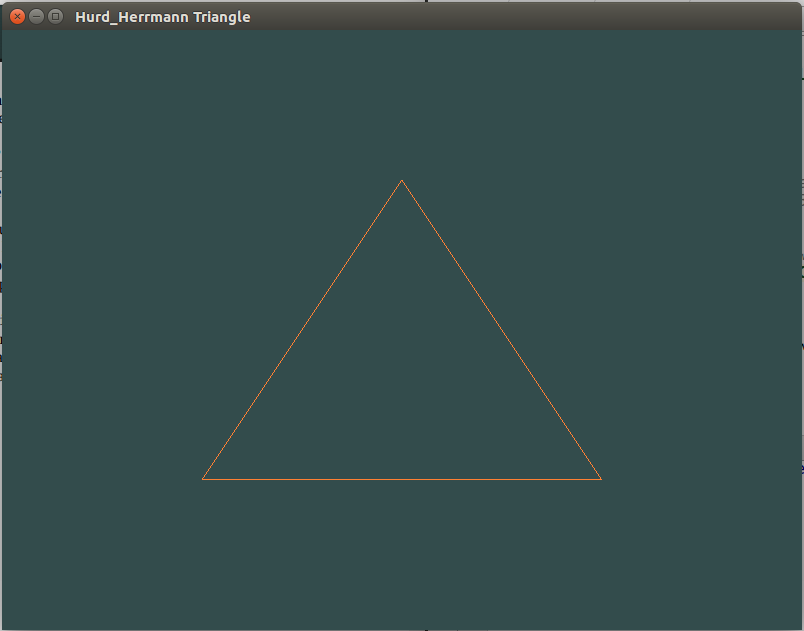

# Graphics18

Museum Plan
We've chosen the theme of BEARS for our museum.
As of the moment we think two to three rooms will be satisfactory.
We have not found textures for our floors and walls yet. We're firsting going to find our art and then we will choose the best textures to compliment them.
We will add a ceil depending on time constraints.
We will have a model of a bear that Molly will create/obtain.
We have not found the pictures for our museum yet.
